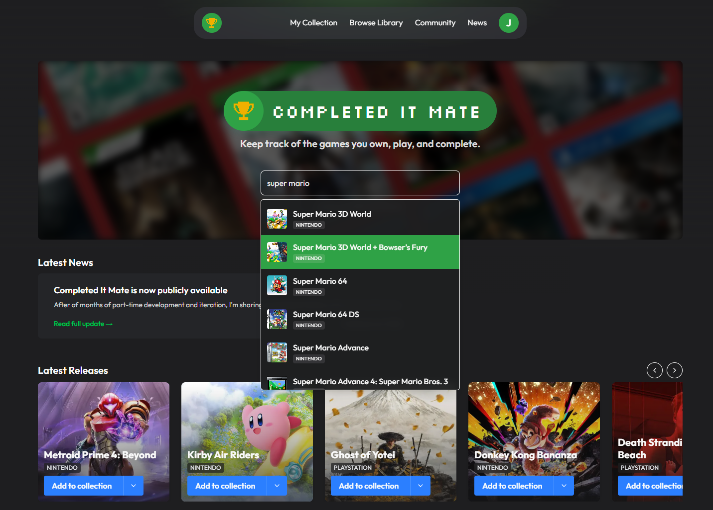
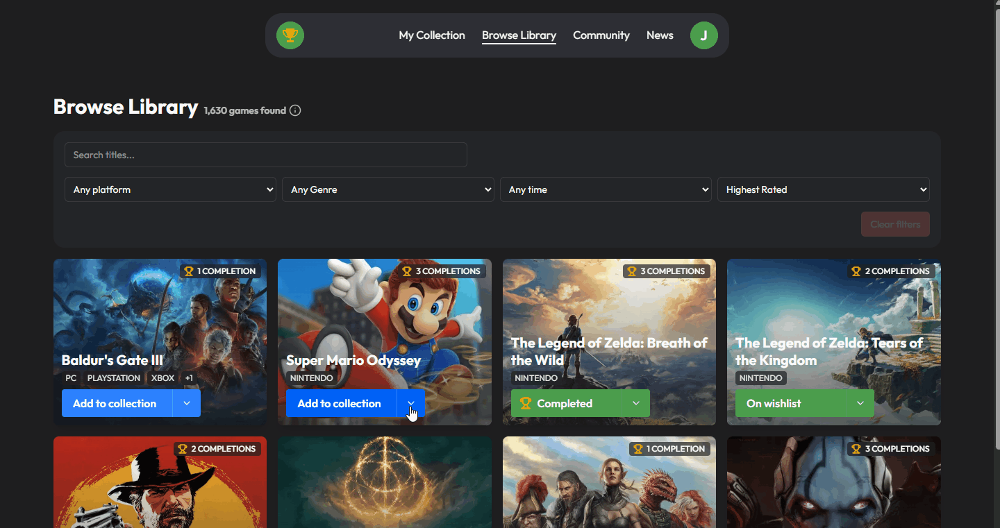
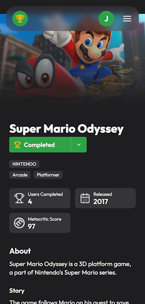

# Completed It Mate – Frontend

Frontend for [**Completed It Mate**](https://completeditmate.app), a production-style web application for tracking video game completions, personal libraries, and community statistics.

Built to prioritise **clarity, responsiveness, and real-world UX trade-offs**, rather than tutorial-driven patterns.


## Screenshots

### Landing page with search functionality


### Community dashboard (marking a game as completed, animated graphs)


### Game detail view (mobile)


---

## Tech Stack

- **Next.js (App Router)** + React + TypeScript  
- **Tailwind CSS** for fast, consistent UI iteration
- **Framer Motion** for subtle UI transitions and interaction feedback   
- **shadcn/ui** component primitives and charting (Recharts-based), locally owned and styled with Tailwind  
- **GitHub Actions** for automated build and deployment  

---

## Why this exists

Completed It Mate was built as a **portfolio-grade, end-to-end product**, not a tutorial app.

The goal was to simulate the kinds of decisions made on a real product:

- Frictionless onboarding over forced sign-up  
- Read-heavy dashboards over premature optimisation  
- Fast iteration supported by clear UX flows and a deliberately simple frontend

---

## Key Features

- Zero-friction onboarding using persistent device-based identity  
- Personal game library with completion tracking  
- Community dashboards aggregating global completion stats  
- Responsive UI designed mobile-first, then scaled up  
- Optimistic UI updates with clear loading and error states  

---

## Related Repositories

- 👉 **Backend API**: https://github.com/jbhall4291/completed-it-mate-be  
- 👉 **Live site**: https://completeditmate.app


---

## Getting Started

```bash
npm install
npm run dev
